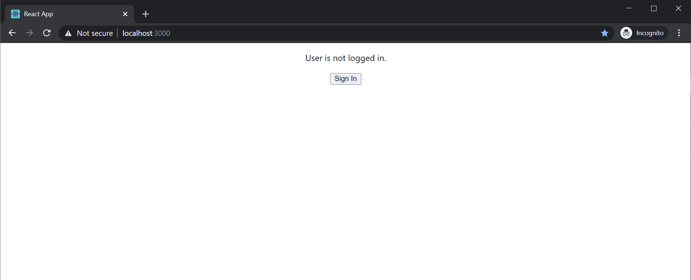
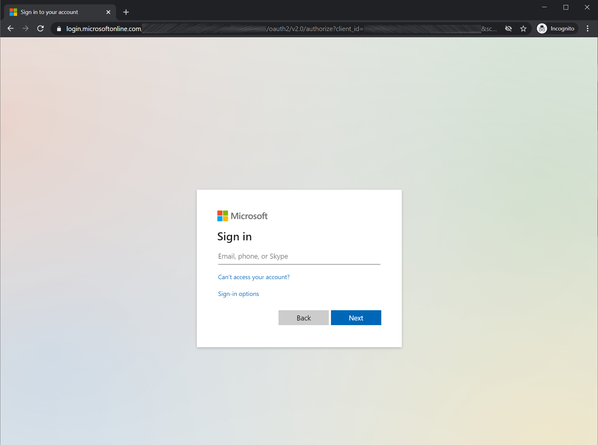
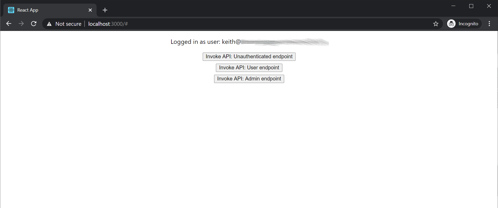
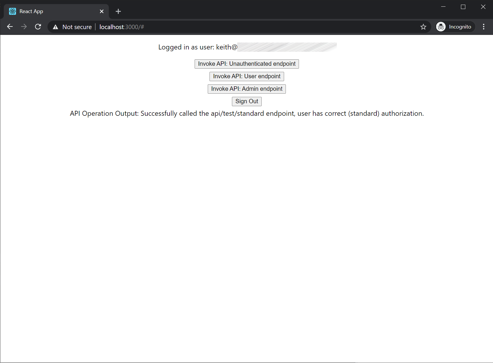
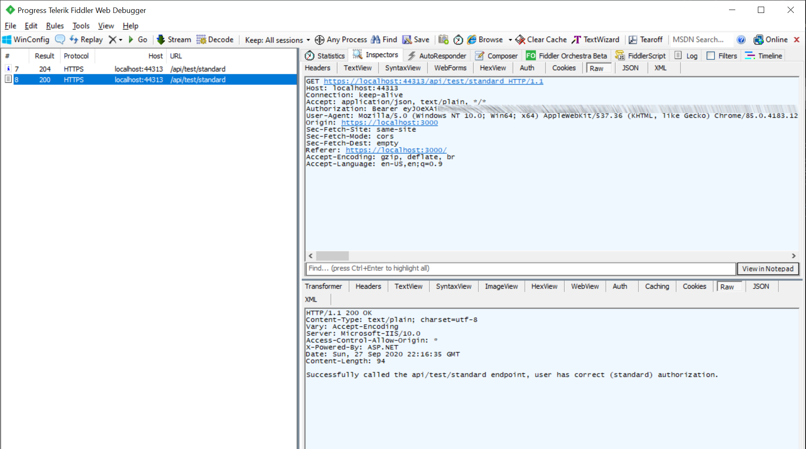

# SampleMsalAuthorizationCodeFlow
An example project to demonstrate the OAuth 2.0 authorization code flow against a protected web api resource with RBAC roles.

## Auth Scenario
* Client: React SPA with Typescript, leveraging MSAL.JS 2.0
* API: ASP.NET Core Web API 3.x
* Azure AD: Single app registration with RBAC roles

## Tutorial Post

For an end-to-end walkthrough and frequently asked questions, visit the linked blog post: https://keithbabinec.com/2020/09/27/oauth-2-0-authorization-code-flow-with-a-react-spa-asp-net-core-web-api-rbac-roles-and-msal

## Azure AD configuration

These steps are required before you can build and run the application. All steps are to be executed from a PowerShell prompt.

1. Install Azure CLI tooling: [install-azure-prerequisites.ps1](setup-scripts/install-azure-prerequisites.ps1)
    ```powershell
    install-azure-prerequisites.ps1
    ```

2. Configure application RBAC groups: [new-rbac-groups.ps1](setup-scripts/new-rbac-groups.ps1)
    ```powershell
    new-rbac-groups.ps1 -RbacGroupNames 'MyAppUsersGroup','MyAppAdministratorsGroup'
    ```

3. Create Azure AD app registration: [new-app-registration.ps1](setup-scripts/new-app-registration.ps1)
    ```powershell
    new-app-registration.ps1 -AppRegistrationName 'authorization-flow-test-app' -RbacRoleNames 'MyAppUsersRole','MyAppAdministratorsRole'
    ```

4. Create Azure AD app service principal: [new-app-serviceprincipal.ps1](setup-scripts/new-app-serviceprincipal.ps1)
    ```powershell
    new-app-serviceprincipal.ps1 -AppRegistrationName 'authorization-flow-test-app'
    ```

The following additional manual steps are required because no reasonable Azure tooling operation exists (yet) or they require more environment specific information.

5. In **Azure AD Groups**, add at least one user to each of the role groups created in step 2.

6. In the **Azure AD app registration**, click on the **Authentication** page then add your redirect URI's.
    * These must be of type 'SPA' and not 'Web', otherwise the auth flow will fail.
    * At minimum, add your local debug URI: https://localhost:3000 -- but you can also add your production environment redirects here if you know what they will be.

7. In the **Azure AD app registration**, click on the **Expose an API** page then take note of **scope** defined by the API.
    * There should be a default 'user_impersonation' scope created if you ran the script from step 4.
    * Copy the scope URI because it will be used in the MSAL app config later.

8. In the **Azure AD app service principal** (enterprise application), click on the **Properties** page, then set the **User Assignment Required** field to Yes.
    * This must be set to enforce authorized access to your client app.

9. In the **Azure AD app service principal** (enterprise application), click on the **Users and Groups** page, then assign users or groups to the custom app roles you have defined.

## Build and Run: Web API

1. Restore nuget packages.

2. Update [appsettings.json](web-api/appsettings.json) and [appsettings.Development.json](web-api/appsettings.Development.json) with the Azure AD app registration details from the above setup.

3. Launch the project, take note of the locally hosted URI.

4. Test that the endpoints are available.
    * Open a PowerShell prompt and send a test request against each of the 3 endpoints in the sample project. 
    * Replace the URI below with the specific port from your machine. The following shows the responses you should expect to see without specifying auth headers:

    ```powershell
    Invoke-RestMethod -Uri https://localhost:44313/api/test/noauth -Method Get
    # should return: Successfully called the api/test/noauth endpoint, as an unauthenticated/anonymous user.

    Invoke-RestMethod -Uri https://localhost:44313/api/test/standard -Method Get
    # should return: Invoke-RestMethod: Response status code does not indicate success: 401 (Unauthorized).

    Invoke-RestMethod -Uri https://localhost:44313/api/test/admin -Method Get
    # should return: Invoke-RestMethod: Response status code does not indicate success: 401 (Unauthorized).
    ```

## Build and Run: Web Client

1. Restore NPM packages
    ```
    npm install
    ```

2. Update [.env.development](web-client/.env.development) and [.env.production](web-client/.env.production) with the Azure AD app registration details from the above setup.

3. Start the project with local debugging.
    ```
    npm start
    ```

4. When the application starts in the browser:
    * Click the 'login' button, which will redirect you to the Microsoft Identity platform to sign in.
    * Sign in with a user that has been assigned to one of your app roles.
    * Upon redirect you should see buttons to invoke the 3 test web api endpoints.
    * Invoke the test endpoints to validate the end-to-end flow.

## Screenshots









